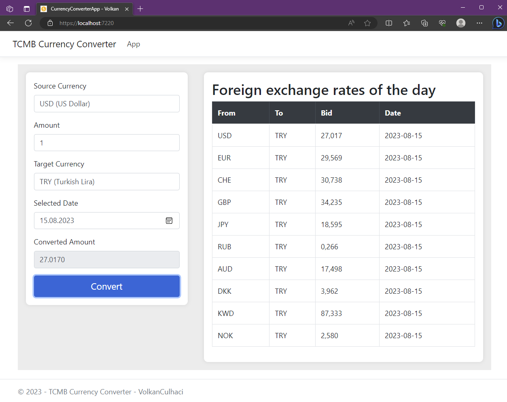
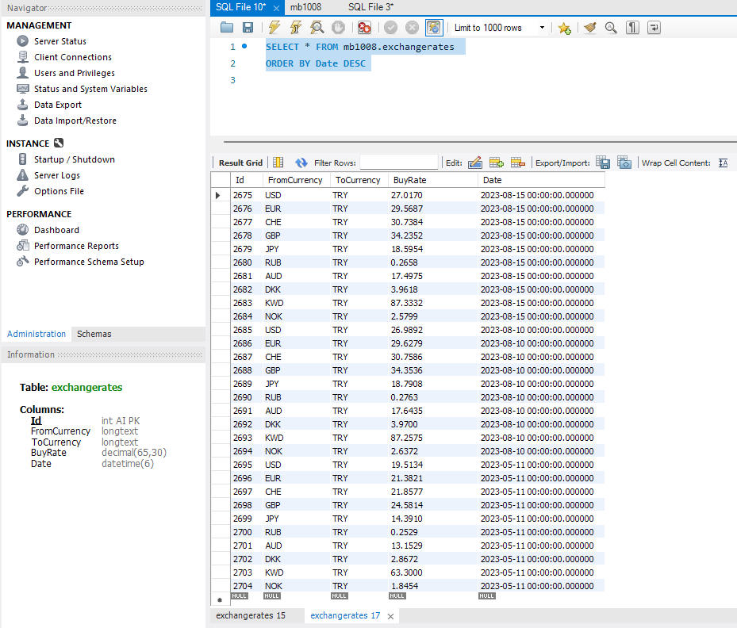

# TCMB Currency Converter

This web application allows users to convert currency exchange rates using data from the Turkish Central Bank (TCMB).

## Features

- Convert currency exchange rates from selected source currency to target currency.
- Retrieve exchange rates from TCMB for the selected date.
- Store and retrieve exchange rates from a local database.
- Automatically update exchange rates from TCMB on a daily basis.
- Display a table of foreign exchange rates of the day.
- Calculate and display converted amounts.

## Technologies Used

- ASP.NET Core MVC
- Entity Framework Core
- HTML, CSS, JavaScript
- MySQL
- 
## Versions

| Id                                   | Versions      |
|--------------------------------------|---------------|
| Microsoft.VisualStudio.Web.CodeGeneration.Design | {6.0.16}      |
| log4net.Extensions.AspNetCore         | {1.0.0}       |
| Pomelo.EntityFrameworkCore.MySql      | {6.0.1}       |
| Microsoft.EntityFrameworkCore          | {6.0.3}       |
| Newtonsoft.Json                       | {13.0.3}      |
| Microsoft.EntityFrameworkCore.Tools  | {6.0.3}       |

## Getting Started

1. Clone the repository to your local machine.
2. Configure the database connection string in `appsettings.json`.
3. Build and run the application using Visual Studio or the command line.
4. Open your browser and navigate to the application's URL.

## Usage

1. Select the source currency, target currency, amount, and date.
2. Click the "Convert" button to calculate the converted amount.
3. View the converted amount in the "Converted Amount" field.
4. Scroll down to view the table of foreign exchange rates.

## Screenshots

## Important Note:
Please be aware that TCMB does not update currency rates on weekends and holidays. Therefore, the system does not calculate information for these specific days.

## Suggestions for Improvement:
1. For potential usage expansion, consider creating a new currency table. This step can enhance efficiency and prevent redundancy.

2. To enhance user experience, ensure that weekends and holidays are blocked on the calendar when selecting dates.

3. The Exchange Rates table on the right-hand side should automatically update itself when a new date is selected.

4. Consider removing the Convert button for a more streamlined interface.

## License

This project is licensed under the MIT License - see the [LICENSE](/LICENSE) file for details.

---

# TCMB Döviz Çevirici

Bu web uygulaması, kullanıcıların Türkiye Cumhuriyet Merkez Bankası (TCMB) verilerini kullanarak döviz kurlarını dönüştürmelerine olanak tanır.

## Özellikler

- Döviz kurlarını seçilen kaynak para biriminden hedef para birimine dönüştürün.
- Seçilen tarih için TCMB'den döviz kurlarını alın.
- Döviz kurlarını yerel bir veritabanında saklayın ve alın.
- TCMB'den döviz kurlarını günlük olarak otomatik olarak güncelleyin.
- Günün döviz kurlarının bir tablosunu görüntüleyin.
- Dönüştürülmüş tutarları hesaplayın ve görüntüleyin.

## Kullanılan Teknolojiler

- ASP.NET Core MVC
- Entity Framework Core
- HTML, CSS, JavaScript
- MySQL

## Versiyonlar

| Id                                   | Versions      |
|--------------------------------------|---------------|
| Microsoft.VisualStudio.Web.CodeGeneration.Design | {6.0.16}      |
| log4net.Extensions.AspNetCore         | {1.0.0}       |
| Pomelo.EntityFrameworkCore.MySql      | {6.0.1}       |
| Microsoft.EntityFrameworkCore          | {6.0.3}       |
| Newtonsoft.Json                       | {13.0.3}      |
| Microsoft.EntityFrameworkCore.Tools  | {6.0.3}       |

## Başlarken

1. Depoyu yerel makinenize klonlayın.
2. Veritabanı bağlantı dizesini `appsettings.json` içinde yapılandırın.
3. Visual Studio veya komut satırını kullanarak uygulamayı derleyin ve çalıştırın.
4. Tarayıcınızı açın ve uygulamanın URL'sine gidin.

## Kullanım

1. Kaynak para birimini, hedef para birimini, tutarı ve tarihi seçin.
2. Dönüştürülen tutarı hesaplamak için "Dönüştür" düğmesine tıklayın.
3. Dönüştürülen tutarı "Dönüştürülen Tutar" alanında görüntüleyin.
4. Döviz kurları tablosunu görüntülemek için aşağı kaydırın.

## Ekran Görüntüleri

## Önemli Not:
TCMB'nin hafta sonları ve tatil günlerinde döviz kurlarını güncellemediğini lütfen unutmayın. Bu nedenle, sistem bu belirli günler için bilgi hesaplamaz.

## İyileştirme Önerileri:
1. Potansiyel kullanım genişlemesi için, yeni bir para birimi tablosu oluşturmayı düşünün. Bu adım verimliliği artırabilir ve fazlalığı önleyebilir.

2. Kullanıcı deneyimini geliştirmek için, tarihleri seçerken hafta sonlarının ve tatillerin takvimde engellendiğinden emin olun.

3. Yeni bir tarih seçildiğinde sağ taraftaki Döviz Kurları tablosu kendini otomatik olarak güncellemelidir.

4. Daha akıcı bir arayüz için Convert butonu kaldırılmalıdır.

## Lisans

Bu proje MIT Lisansı altında lisanslanmıştır - ayrıntılar için [LICENSE](/LICENSE) dosyasına bakın.

